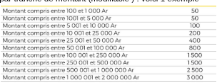

# Thème
Ce sera un système qui va simuler un opérateur de mobile money

## Version 1
* Coté opérateur
    - Configuration des préfixes valable de l’opérateur (ex: 033 et 037)
    - Création de types d'opérations (dépôt, retrait, transfert) avec des barèmes de frais par tranche de montant (modifiable ) . 
    - voici 1 exemple
    
    - Situation gain via les différents frais ( retrait et transfert)
    - Situation des comptes clients 
* Coté client
    - Login automatique avec le numéro de téléphone
    - pas d’inscription au préalable
    - Opérations
    - voir le solde
    - faire un dépot ( supposer que c’est automatique)
    - faire un retrait  ( supposer que c’est automatique)
    - faire un transfert
    - voir les historiques

>_Livraison à 13h ( mettre Tag v1)_

### Tache pour 4034:
**V1:** 
- préparation de la structure du projet :fait
- remplissage du formulaire demandé par les prof : fait
- préparation de la database dans writable en .sqlite: fait
- aide à la compréhension : en cours
- configuration des sessions dans le dossier Filters : en cours
- configuration des modèles : en cours
- utilisation des migrations pour les tables : en cours 

### Tache pour 4075:
**V1:**
- composition de la base : fait
- compréhension du sujet : fait
- creation des fichiers de migrations : fait
- creation des fichier seeds : fait